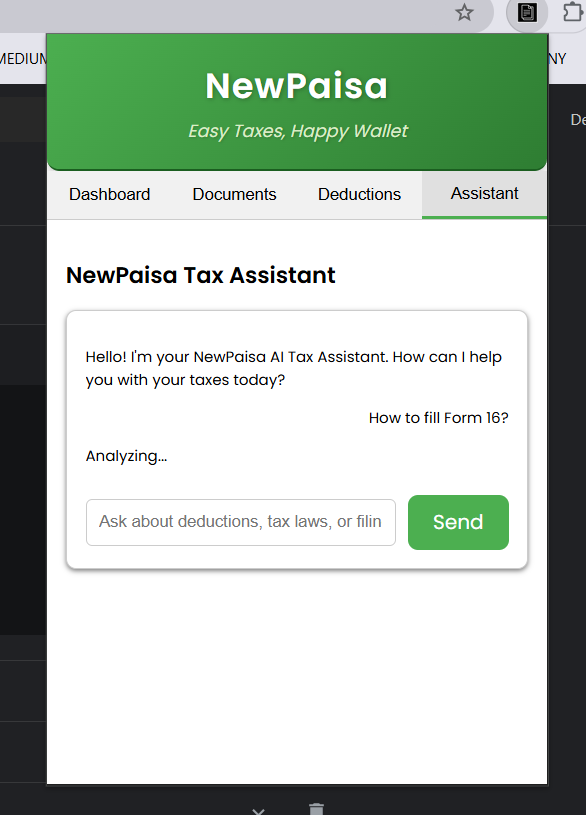

# NewPaisa: Easy Taxes, Happy Wallet


---

## 🚀 Overview

A cool Chrome Extension that helps newbie taxpayers to Ease the complicated process of Tax Filing by automating certain aspects & while leveling up their financial(tax) literacy!

---

## ⚙️ Installation Guide

1. Clone the repository:

   ```bash
   git clone https://github.com/Sarzam/NewPaisa.git
   cd NewPaisa
   ```

2. Open Chrome and navigate to `chrome://extensions/`
3. Enable 'Developer mode'
4. Click 'Load unpacked' and select the cloned project folder

---

## 🔗 Demo Screenshots

Here are some snapshots of the extension in action:

### Dashboard



### Document Upload


### NewPaisa AI Tax Assistant


### NewPaisa Quiz (Based on Monte Carlo simulation)


### Hover Button


---

## 🛠️ Developed By

## Misbah Shaikh

- [LinkedIn](https://www.linkedin.com/in/misbahsrshaikh)
- [GitHub](https://github.com/Sarzam)

---
